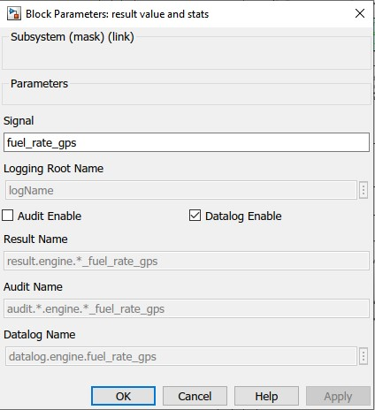

ALPHA Development
=================

.. _ad-crossref-1:

Conventions and Guidelines
^^^^^^^^^^^^^^^^^^^^^^^^^^
There are a few guidelines that cover the use of variable names within the modeling environment and other conventions.  Understanding and following the guidelines facilitates collaboration, ease of use and understanding of the modeling environment.

* Class definitions start with ``class_``.

* Enumerated datatype definitions start with ``enum_``.

* Physical unit conversions should be accomplished using the ``unit_convert`` class.  For example ``engine_max_torque_ftlbs`` = ``engine_max_torque_Nm`` * ``unit_convert.Nm2ftlbs``.  Avoid hard-coded conversion constants.

* Any variable that has corresponding units should take the form ``variable_units``, such as ``vehicle_speed_kmh`` or ``shaft_torque_Nm``.  SI units are preferred whenever possible unless superseded by convention (such as roadload ABCs).  Units commonly use lowercase 'p' for 'per'.  For example mps = meters per second, radps = radians per second.  Readability outweighs consistency if convention and context allows, for example ``vehicle_speed_mph`` is understood to be vehicle speed in miles per hour, not meters per hour.

* English units are used by a class, but that class should also provide SI equivalents.  REVS provides some framework and examples of automatic unit conversions that may be used.

* Variable names should be concise but abbreviations or acronyms are generally to be avoided unless superseded by convention.  For example, ``datalog.transmission.gearbox``, not ``dl.trns.gbx``.  Exceptions are bus signal names and the port names on Simulink blocks (long names reduce readability rather than enhancing it) - for example, torque may be trq and speed may be spd. Simulink block names may also receive abbreviated names to enhance readability.

* Underscores are preferred for workspace and data structure variable names, for example ``selected_gear_num``.  Camelcase is preferred for variables defined in Simulink masks and local block workspaces so they may be distinguished from ordinary workspace variables.

* Most functions that are specific to the REVS modeling platform start with ``REVS_``.

* The 'goto' and 'from' flags are to be avoided in Simulink blocks as they significantly decrease the readability and understanding of block connections.  Exceptions to this rule are the ``REVS_VM top-level system_bus`` component sub-buses, the ``global_stop_flag`` and the ``REVS_audit_phase_flag`` which must be made available throughout the model.

* Trivial Simulink blocks (such as multiplication, addition, etc) may have their block names hidden to enhance readability; non-trivial blocks should have names which concisely and accurately describe their function.

* Simulink blocks should have a white background and a black foreground.  Exceptions are red foreground for blocks that are deprecated or orange foreground for blocks that may be unproven or experimental.

* Useful Simulink blocks should be added to the appropriate ``REVS_Common`` model library if they are likely to be reused.

* Simulink block names are lowercase unless superseded by convention and words are separated by spaces (as opposed to underscores).

* Simulink blocks that take in the system bus should have ``system_bus`` as input port 1.

* Simulink blocks that produce a signal bus should have ``bus_out`` as output port 1.

* Whenever possible, variant subsystem blocks should be controlled by a ``variant`` string property that matches the name of the block to be selected.

Customizing the Batch Process
^^^^^^^^^^^^^^^^^^^^^^^^^^^^^

Custom Pre- and Post-Processing
-------------------------------

Creating and Using Config String Tags
-------------------------------------

Custom Output Summary File Formats
----------------------------------

REVS_VM
^^^^^^^

Overview
--------
Powertrain Variants
-------------------

Understanding the Simulink Libraries
^^^^^^^^^^^^^^^^^^^^^^^^^^^^^^^^^^^^
accessory_lib
-------------
Contains blocks for describing mechanical and electrical accessory loads.

ambient_lib
-----------
The ``ambient`` variant block is the source of road grade (as a function of distance) and ambient temperature.  The time ``datalog`` is also created here.  Alternative ambient blocks can be created and selected using the ``ambient.version`` property

controls_lib
------------
Contains the ``controls`` variant block and other controls-related blocks.  The control blocks determine engine start-stop and control strategies for hybrid vehicles.

driver_lib
----------
Contains the ``driver`` variant block, which determines the closed-loop drive cycle follower.  The ``driver`` block produces the accelerator and brake pedal signals to the rest of the model as well as a few other signals such as the drive cycle speed, phase, and position in seconds.  Alternative driver blocks can be created and selected using the ``driver.version`` property

electric_lib
------------
Contains energy storage (battery) models and other electrical components such as starter, alternator, and e-machine (motor-generator) models.

engine_lib
----------
Contains the ``engine`` variant block and engine and engine-related models, such as cylinder deactivation logic.

general_lib
-----------
Contains various utility blocks that may be used throughout the model, such as dynamic lookup tables, dynamic equations and other handy functions.

logging_lib
-----------
Contains the blocks that handle dynamic data logging within the model, including ``audit`` logging and drive cycle phase ``result`` values.

powertrain_lib
--------------
Contains the top-level ``powertrain`` variant block, and defines the available powertrains for conventional and hybrid vehicles.

transmission_lib
----------------
Contains transmission models for conventional and hybrid vehicles, and component models for things like clutches and torque converters.

vehicle_lib
-----------
Contains models of brakes, tires and other driveline components like axles, as well as the vehicle roadload calculations.

Understanding Datalogging
^^^^^^^^^^^^^^^^^^^^^^^^^
Logging Overview
----------------
Logging model internal signals is probably one of the most important things the model does, it is also one of the things that has the biggest impact on model run time.  Simulink seems to incur quite a bit of overhead related to logging data to the workspace.  As a result, ALPHA implements a flexible system to control how much or how little data is logged from the model.  In this way, the user can trade off run time speed and the logging of signals of interest.

The ``REVS_Common\log_packages`` folder contains functions to define pre-made 'packages' of signals for datalogging, and also scripts for post-processing the data if required.

``class_REVS_log_package`` defines the data structure used to define datalogs.  Each package has three properties:

* ``log_list`` - a list of ``datalog`` or ``result`` signals to enable.  Signal names can include ``*`` wildcards.  For example, ``result.engine.crankshaft*`` would log all result signals that start contain ``engine.crankshaft`` such as ``result.phase.engine.crankshaft_tot_kWh`` or ``result.phase.engine.crankshaft_pos_kJ``.  Result signals are a unique form of datalog that record final values for each phase of the drive cycle.  So for each phase of the drive cycle a ``result`` will contain a scalar value for each signal.  The result may be a sum or an average or other statistical data such as a minimum or maximum.  See the ``logging_lib`` for more details.

* ``package_list`` - a package may contain other packages, however in practice, each package lists itself in the ``package_list`` and the total package list is the unique set of all the individual packages.  So, each ``REVS_log_XXX.m`` will contain ``log_package.package_list = {mfilename};``.  Metapackages are formed by creating a list of packages, such as ``REVS_log_CVM_metapackage`` which creates the metapackage of conventional vehicle model (CVM) datalogs:

::

    function [log_package] = REVS_log_CVM_metapackage()

    log_package = [
                   REVS_log_vehicle_basics
                   REVS_log_engine_basics
                   REVS_log_transmission
                   REVS_log_alternator
                   REVS_log_accessory_battery
                   REVS_log_mech_accessories
                  ];

    end

* ``postprocess_list`` - contains a list of one or more post-processing scripts to run after the workspace has been populated with data.  For example, ``REVS_log_engine_basics`` lists ``REVS_postprocess_engine_basics_log`` to post-process data from raw simulation signals into the ``model_data`` structure for more universal use in post-processing scripts such as plotting simulation data versus real-world test data as in a ``DOR``.

Logging Details
---------------
Since it's not possible for Simulink datalogs to directly create stuctured output, there is a process for populating hierarchical data structures from individual workspace datalog variables.  This possible through the naming scheme employed by the datalogging blocks.  For example, the raw post-simulation workspace will contain variables such as:

::

    audit__accessories__air_conditioner__elec_neg_kJ
    dl__engine__crankshaft_trq_Nm
    rsltp__engine__fuel_consumed_g

The prefix determines the top-level data structure.  ``audit`` maps to the ``audit`` data structure, ``dl`` maps to ``datalog`` and ``rsltp`` maps to the ``phase`` property of the ``result`` data structure, as in ``result.phase``.

The double underscores, ``__``, define the hierarchical structure.  For example, ``audit__accessories__air_conditioner__elec_neg_kJ`` will become ``audit.accessories.air_conditioner.elec_neg_kJ`` in the final workspace.  Single underscores are taken as part of the property name.

The construction of the raw workspace variable names is handled by the mask of the datalog blocks and can determined by the structure of the model.  For example, datalogs in the ``engine`` block model will automatically be placed in the ``datalog.engine`` structure without having to be explicitly named as such.  For example, the ``datalog.engine.fuel_rate_gps`` signal is set up as follows:

The only user-specified part of the name is ``fuel_rate_gps``, the rest is automatic, and the final result is previewed in the ``Datalog Name`` text box.

Understanding Auditing
^^^^^^^^^^^^^^^^^^^^^^
Auditing is controlled through the ``sim_batch`` object ``audit_total`` and ``audit_phase`` boolean properties.

If ``audit_total`` is ``true`` then an audit for the drive cycle as a whole will be performed and the resulting summary will be sent the console or an output file.  This is the most commonly used approach for enabling an audit.

If ``audit_phase`` is ``true`` then an audit for each drive cycle phase **and** the total drive cycle will be produced.

Setting both ``audit_total`` and ``audit_phase`` to ``true`` results in the same output as setting ``audit_phase`` by itself.

The ``audit`` structure, like the ``result`` structure, contains only scalar values.

For example:

::

    >> audit.total.engine

        ans =

            class_REVS_logging_object with properties:

                 crankshaft_delta_KE_kJ: 0.3309
                crankshaft_delta_KE_kWh: 9.1911e-05
                      crankshaft_neg_kJ: 604.0453
                     crankshaft_neg_kWh: 0.1678
                      crankshaft_pos_kJ: 7.4220e+03
                     crankshaft_pos_kWh: 2.0617
                      crankshaft_tot_kJ: 6.8180e+03
                     crankshaft_tot_kWh: 1.8939
                        fuel_consumed_g: 703.2932
                           gross_neg_kJ: 450.6905
                          gross_neg_kWh: 0.1252
                           gross_pos_kJ: 8.0877e+03
                          gross_pos_kWh: 2.2466
                           gross_tot_kJ: 7.6371e+03
                          gross_tot_kWh: 2.1214

    >> audit.phase.engine

        ans =

          class_REVS_logging_object with properties:

             crankshaft_delta_KE_kJ: [0.3321 -0.0017]
            crankshaft_delta_KE_kWh: [9.2236e-05 -4.6631e-07]
                  crankshaft_neg_kJ: [250.3882 353.6571]
                 crankshaft_neg_kWh: [0.0696 0.0982]
                  crankshaft_pos_kJ: [3.6640e+03 3.7581e+03]
                 crankshaft_pos_kWh: [1.0178 1.0439]
                  crankshaft_tot_kJ: [3.4136e+03 3.4044e+03]
                 crankshaft_tot_kWh: [0.9482 0.9457]
                    fuel_consumed_g: [319.6850 383.6047]
                       gross_neg_kJ: [192.0876 258.6029]
                      gross_neg_kWh: [0.0534 0.0718]
                       gross_pos_kJ: [3.9019e+03 4.1858e+03]
                      gross_pos_kWh: [1.0839 1.1627]
                       gross_tot_kJ: [3.7098e+03 3.9272e+03]
                      gross_tot_kWh: [1.0305 1.0909]

It should be noted here that the total and phase audits may appear to have discrepancies.  In other words, the sum of the phase audit results may not add up to the total result for the same variable, such as ``fuel_consumed_g``.  This is because the phase audit results are only for phase numbers greater than zero.  In the case of a drive cycle where the engine start is not sampled (not part of the phase results), the first five seconds may be phase zero.  Also, it takes a couple of simulation time steps at the end of the drive cycle to shut down the model, and those are also phase zero.

Enabling the audits populates the workspace with audit data, via the ``class_REVS_audit`` class.  ``class_REVS_audit`` is also responsible for calling the report generators for each unique powertrain type, as follows:

* ``class_REVS_CVM_audit`` - calculates and reports energy balances for Conventional Vehicle Models

* ``class_REVS_EVM_audit`` - calculates and reports energy balances for Electric Vehicle Models

* ``class_REVS_HVM_audit`` - calculates and reports energy balances for Hybrid Vehicle Models

There is no automatic method for the Simulink model itself to comprehend the correct sources and sinks of energy within the model, this is determined by the creator of the model and is based on the underlying physics of the powertrain components.

The audit classes for the various powertrains inherit methods and properties from a base class, ``class_REVS_VM_audit``, which handles audit calculations common to all powertrains, i.e. brakes, tires, roadload losses, etc.

The audit energy datalogs (as seen above) are tallied according to whether they are sources of energy or sinks of energy in the ``calc_audit`` methods of the audit classes.  If the model, audit datalogging and audit calculations are correct then the sum of the energy in the audit sinks will equal the sum of the energy in the audit sources.  The sources and sinks are tallied in the ``energy_balance`` property of the audit class.

::

    >> audit.total.energy_balance

    ans =

      struct with fields:

                         source: [1×1 struct]
                           sink: [1×1 struct]
            simulation_error_kJ: -0.5840
        energy_conservation_pct: 100.0157

    >> audit.total.energy_balance.source

    ans =

      struct with fields:

              KE_kJ: 0
        gradient_kJ: 0
              gross: [1×1 struct]
                net: [1×1 struct]

    >> audit.total.energy_balance.sink

    ans =

      struct with fields:

            KE_kJ: 0.4379
          vehicle: [1×1 struct]
        accessory: [1×1 struct]
         total_kJ: 3.7313e+03

The audit sources consist of ``gross`` and ``net`` categories, where ``gross`` refers to fuel chemical energy and energy stored in batteries, for example.  ``net`` refers to energy used to power the vehicle and/or run electrical accessories, for example.

::

    >> audit.total.energy_balance.source.gross

    ans =

      struct with fields:

          fuel_kJ: 1.3157e+04
        stored_kJ: 8.0583
         total_kJ: 1.3165e+04

    >> audit.total.energy_balance.source.net

    ans =

      struct with fields:

                    engine_kJ: 3.7237e+03
        engine_efficiency_pct: 28.3017
                    stored_kJ: 7.0347
                     total_kJ: 3.7307e+03

The difference between the net source energy and the total sink energy is the simulation error, which should be very small and is recorded as the energy balance ``energy_conservation_pct`` where 100% is the desired value.

::

    >> audit.total.energy_balance.source.net.total_kJ

    ans =

       3.7307e+03

    >> audit.total.energy_balance.sink.total_kJ

    ans =

       3.7313e+03

    >> audit.total.energy_balance.energy_conservation_pct

    ans =

      100.0157

Typical sources of simulation error are clutch / driveline re-engagements where the small modeled disparity in speeds at lockup causes a small gain or loss of kinetic energy.  If the audit is off by a larger amount then either there is a problem with the model or a problem with the audit itself.  Most of the time the audit is incorrect when there's a discrepancy.  For example, a new component may have been added to the model but the ``calc_audit`` function has not been updated to include the energy as a source or sink, or perhaps the audit datalog has been placed on the wrong signal line or at the incorrect point in the model.  One technique for sorting out whether an error is a just a simulation error due to approximation (like the slightly mismatched speeds) or due to an actual or accounting error is to run the model at a finer timestep.  Generally, simulation errors should decrease as the step size decreases and audit or accounting errors should remain unchanged.

When creating an audit for a new component it's very important to understand that the topology of the blocks in the model in most cases is not the same as the topology of the sources and sinks of energy in the model.  It's tempting to place an audit datalog at the inputs and outputs of the blocks in the model, but if the block is not properly a source or sink of energy then the audit will likely fail.  For example, torques and speeds may pass through several Simulink blocks, but each block is not necessarily a "source" of energy for the next block downstream.

In any case, it's important to track down audit issues if and when they occur.

Component Development
^^^^^^^^^^^^^^^^^^^^^

Data Structures and Classes
^^^^^^^^^^^^^^^^^^^^^^^^^^^
