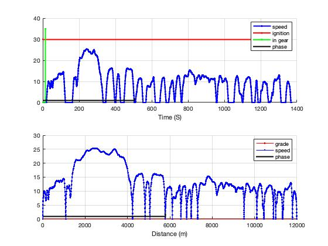

Common Use Cases
================

This chapter will present a few common use cases of ALPHA as an aid to getting started.

Running a Batch with Various Engines
^^^^^^^^^^^^^^^^^^^^^^^^^^^^^^^^^^^^

The typical method of running several engines is simply to define the engine names as strings in the workspace then set up simulation cases for each one.  For example:

::

    GDI_ENGINE             = 'ENG:engine_2013_Chevrolet_Ecotec_LCV_2L5_Reg_E10';
    TDS12_ENGINE           = 'ENG:engine_2016_Honda_L15B7_1L5_Tier2';
    TDS12_ENGINE2          = 'ENG:engine_2016_Honda_Turbo_1L5_paper_image';
    TDS21_ENGINE           = 'ENG:engine_future_Ricardo_EGRB_1L0_Tier2';
    TDS11_ENGINE           = 'ENG:engine_2015_Ford_EcoBoost_2L7_Tier2';
    TDS11_ENGINE2          = 'ENG:engine_2013_Ford_EcoBoost_1L6_Tier2';
    ATK2p0_ENGINE          = 'ENG:engine_2014_Mazda_Skyactiv_2L0_Tier2';
    ATK2p0_CEGR_ENGINE     = 'ENG:engine_future_atkinson_CEGR_2L0_tier2';
    TNGA_ENGINE            = 'ES_CYL:6 + ENG:engine_2016_toyota_TNGA_2L5_paper_image';
    ATK2p5_ENGINE          = 'ENG:engine_2016_Mazda_Skyactiv_Turbo_2L5_Tier2';
    ATK2p0_X_ENGINE        = 'ENG:engine_future_Mazda_Skyactiv_X_2L0_paper_image';

    config_strings = {
        ['PKG:1a + ' base_config TDS11_ENGINE2 	    ...]
        ['PKG:1b + ' base_config TDS11_ENGINE  	    ...]
        ['PKG:1c + ' base_config TDS12_ENGINE2 	    ...]
        ['PKG:1d + ' base_config TDS12_ENGINE 	    ...]
        ['PKG:1e + ' base_config TDS21_ENGINE 	    ...]
        ['PKG:1f + ' base_config ATK2p0_ENGINE 	    ...]
        ['PKG:1g + ' base_config TNGA_ENGINE 	    ...]
        ['PKG:1h + ' base_config ATK2p5_ENGINE 	    ...]
        ['PKG:1i + ' base_config ATK2p0_X_ENGINE    ...]
        ['PKG:1j + ' base_config ATK2p0_CEGR_ENGINE ...]
    ...
    };

    sim_batch.load_config_strings(config_strings);

In this abbreviated example, ``base_config`` refers to a workspace variable that holds a string of the config tags that all the cases have in common, for example roadload settings, drive cycle selection, fuel type, etc.  Grouping the common settings into a single variable makes it easier to change the setup and improves readability.  Matlab string concatenation does the rest (the use of brackets, [ ], tells Matlab to combine all the separate strings into one).   Another advantage of using workspace variables to hold engine definition strings is illustrated in the ``TNGA_ENGINE`` workspace variable which not only defines the engine but also uses the ``ES_CYL:`` tag to tell the simulation to run as a six-cylinder regardless of any engine resizing that may take place.  Breaking a config string down into smaller substrings and workspace variables is a good technique for managing complexity in larger batches.

The use of the ``PKG:`` defines a quick reference name for each case.

.. _alpha_roadloads_and_test_weight:

ALPHA Roadloads and Test Weight
^^^^^^^^^^^^^^^^^^^^^^^^^^^^^^^

Vehicle weight / inertia is specified by setting the ETW (Equivalent Test Weight, which includes vehicle curb weight and a ballast of 300 pounds and is effectively tested with a 1.5% axle inertia penalty) or by setting the vehicle mass and inertias directly.

Roadloads in ALPHA can be specified either by "ABC" (or "F0, F1, F2") coastdown curve fit coefficients or by directly specifying the coefficients of rolling resistance and aerodynamic drag along with the vehicle's frontal area.

A convenient source of ABC coefficients and test weights is the EPA's own test car data, such as at `<https://www.epa.gov/compliance-and-fuel-economy-data/data-cars-used-testing-fuel-economy>`_.

Setting Vehicle Weight and Inertia
----------------------------------

The test car list format varies somewhat over time, but the vehicle ETW is listed in the ``Equivalent Test Weight (lbs.)`` column in the 2020 test car data.

The ETW in the test car list is determined by vehicle curb weight (with a full tank of gas, all fluids, accessories, etc) plus a 300 lb ballast penalty.  ETW is binned in fixed increments for compliance purposes (a throwback to old water-brake dynos with discrete inertia weights).  Larger test weights are in larger bins.  The bins are defined in `40 CFR § 1066.805 <https://www.ecfr.gov/cgi-bin/text-idx?node=pt40.33.1066&rgn=div5#se40.37.1066_1805>`_.

So ETW is fairly straightforward.  Where it gets more interesting is when the axle inertias are factored into the dyno settings.  As an engineering rule of thumb, the inertia of each axle (including wheels, tires, brakes, etc) acts as an effective 1.5% weight penalty.

As a matter of EPA test procedure for a two-wheel-drive test, the dyno simulated inertia is set to the ETW (See `40 CFR § 1066.410 <https://www.ecfr.gov/current/title-40/chapter-I/subchapter-U/part-1066/subpart-E/section-1066.410>`_).  As a result of the spinning front (or rear) axle, the effective total inertia is ETW * 1.015.

For a 4WD (dual roll) test, if the dyno inertia were set to the ETW, the approximate total inertia would be ETW * 1.03, accounting for both axles spinning.  As a result, for a 4WD test, the dyno inertia is set to ETW * 0.985, since ETW * 1.03 * 0.985 is approximately ETW * 1.015, thereby maintaining the total test inertia when compared with a 2WD certification test.

For consistency with certification testing, setting the ETW results in the simulated inertia being set to ETW * 1.015.  If the intention is to model a vehicle with actual weights and component inertias then the ETW property should not be used, the individual masses and inertias should be set directly instead, as discussed below.

Within ALPHA there are several parameters that determine the vehicle's weight and equivalent weight considering axle inertia.  It is possible to set the mass and inertias directly and independently.  It is also possible to set the ETW and allow for the standard inertia adjustment as described above.

To set ETW, either use the ``ETW_LBS:`` or ``ETW_KG:`` config string tags or set the vehicle's ``ETW_lbs`` or ``ETW_kg`` property in a param file, for example:

::

    vehicle = class_REVS_vehicle;
    ...
    vehicle.ETW_lbs = 3500;

Vehicle Mass Properties
+++++++++++++++++++++++

The ``class_REVS_vehicle`` properties related to mass are:

::

    ETW_kg
    mass_static_kg
    mass_dynamic_kg
    mass_curb_kg
    mass_ballast_kg

    ETW_lbs
    mass_curb_lbs
    mass_ballast_lbs
    mass_static_lbs
    mass_dynamic_lbs

Conversion between pounds and kilograms is automatic, so there is no need for the user to manually convert between SAE and SI units, just set the simulation settings based on the source data used.

The ``curb`` and ``ballast`` masses are the vehicle curb mass and ballast mass as discussed above.  The ``static`` mass is the curb mass plus the ballast mass and the ``dynamic`` mass is the static mass plus weight-equivalent axle inertias, if desired.  The ``dynamic`` mass is used to calculate vehicle acceleration in the model.  The ``static`` mass is used to calculate roadload forces due to road grade and rolling resistance (if ABC coefficients are not used, see below), so both must be set correctly if the drive cycle grade is non-zero or if rolling resistance drag coefficients are used.

Because the mass terms are interrelated, ``class_REVS_vehicle`` provides methods to try to keep them synchronized, such that a change in curb weight will result in a change in the dynamic weight, etc.  Setting the ETW sets the static mass to ETW *  0.985, dynamic mass to ETW * 1.015, ballast mass to 300 lbs and curb weight to static mass minus ballast.  In practice, the various terms can get out of sync depending on the order in which they are set, so it's best to just use the ETW property or set the individual non-ETW terms separately.

Using Component Inertias
++++++++++++++++++++++++

If the goal is to simulate known inertias and actual vehicle weights then it is necessary to set the individual component inertias and masses directly.  For example:

::

    vehicle = class_REVS_vehicle;
    ...
    vehicle.mass_static_kg = 1000
    vehicle.mass_dynamic_kg = 1000 % no default adjustment, actual inertias defined below

    vehicle.drive_axle1.tire.inertia_kgm2 = 0.9 * 4 % for a single-axle-equivalent model
    vehicle.drive_axle1.final_drive.inertia_kgm2 = 0.1
    ... etc

Setting ``mass_static_kg`` defaults the dynamic mass to 1.03 * mass_static, so it needs to also be set manually.

.. _abc_coefficients:

ABC Coefficients
----------------

The test car list format varies somewhat over time, but the ABC coefficients for the 2020 test car data are in the following columns:

::

    Target Coef A (lbf)
    Target Coef B (lbf/mph)
    Target Coef C (lbf/mph**2)

    Set Coef A (lbf)
    Set Coef B (lbf/mph)
    Set Coef C (lbf/mph**2)

The ``Target`` coefficients represent the observed drag forces acting on the vehicle during coastdown, treating the vehicle as a point mass.  The ``Set`` coefficients are determined by coasting the vehicle down on a vehicle dynamometer and adjusting the set coefficients in the target coastdown is achieved, within a tolerance.

It should be noted that the target ABC coefficients represent internal **and** external losses that act on the vehicle during coastdown.  As such, a portion of the ABC coefficients may represent driveline drag that may also be present in the transmission component model, for example.  Using unmodified ABC coefficients will generally result in an over-estimation of the fuel consumption of a vehicle, by a few percent.

``class_REVS_vehicle`` contains a ``calc_roadload_adjust`` method to approximate the driveline loss double-count given a set of target and dyno-set ABC coefficients, based on vehicles in the 2019 test car list.  For more information, see `SAE 2020-01-1064 <https://www.epa.gov/vehicle-and-fuel-emissions-testing/moskalik-using-transmission-data-isolate-individual-losses>`_.  As these losses may vary over time as the fleet evolves, it is the responsibility of the user to determine if the adjustments are appropriate for newer or older vehicles.

ABC coefficients can be specified in SAE or SI units, via the ``class_REVS_vehicle`` properties:

::

        coastdown_target_A_N;                   % coastdown target "A" term, SI units, Newtons
        coastdown_target_B_Npms;                % coastdown target "B" term, SI units, Newtons / (meter / second)
        coastdown_target_C_Npms2;               % coastdown target "C" term, SI units, Newtons / (meter / second)^2

        dyno_set_A_N;                           % dyno set "A" term, SI units, Newtons
        dyno_set_B_Npms;                        % dyno set "B" term, SI units, Newtons / (meter / second)
        dyno_set_C_Npms2;                       % dyno set "C" term, SI units, Newtons / (meter / second)^2

        and

        coastdown_target_A_lbf;                % coastdown target "A" term, SAE units, pounds force
        coastdown_target_B_lbfpmph;            % coastdown target "B" term, SAE units, pounds force / mph
        coastdown_target_C_lbfpmph2;           % coastdown target "C" term, SAE units, pounds force / mph^2

        dyno_set_A_lbf;                         % dyno set "A" term, SAE units, pounds force
        dyno_set_B_lbfpmph;                     % dyno set "B" term, SAE units, pounds force / mph
        dyno_set_C_lbfpmph2;                    % dyno set "C" term, SAE units, pounds force / mph^2

Units provided in SAE units are automatically converted to SI units, and vice versa, so there is no need for the user to manually convert values.

Roadload adjustments, if desired, are stored in:

::

        coastdown_adjust_A_N = 0;               % coastdown adjustment for double counting "A" term, SI units, Newtons
        coastdown_adjust_B_Npms = 0;            % coastdown adjustment for double counting "B" term, SI units, Newtons / (meter / second)
        coastdown_adjust_C_Npms2 = 0;           % coastdown adjustment for double counting "C" term, SI units, Newtons / (meter / second)^2

        and

        coastdown_adjust_A_lbf;                % coastdown adjustment for double counting "A" term, SAE units, pounds force
        coastdown_adjust_B_lbfpmph;            % coastdown adjustment for double counting "B" term, SAE units, pounds force / mph
        coastdown_adjust_C_lbfpmph2;           % coastdown adjustment for double counting "C" term, SAE units, pounds force / mph^2

Adjust values are added to the target values, so they should be negative to decrease roadload.

To enable the use of ABC coefficients, the ``use_abc_roadload`` property should be set to ``true``.  A typical example param file snippet:

::

    vehicle = class_REVS_vehicle;
    ...
    vehicle.use_abc_roadload = true;

    vehicle.coastdown_target_A_lbf         = 32.27;
    vehicle.coastdown_target_B_lbfpmph     = 0.0754;
    vehicle.coastdown_target_C_lbfpmph2    = 0.01993;

ABC coefficients can also be set using config tags. Sample output from ``sim_batch.show_tags`` is shown below (keys are defined in ``REVS_config_vehicle``, as seen in 'Provided by'):

::

    Target and dyno-set tags:

       Key                                    |     Tag                |     Default Value                  |     Provided by                |     Description
    -------------------------------------------------------------------------------------------------------------------------------------------------------

    target_A_lbs                              |  TRGA_LBS              |                                    |  REVS_config_vehicle           |
    target_B_lbs                              |  TRGB_LBS              |                                    |  REVS_config_vehicle           |
    target_C_lbs                              |  TRGC_LBS              |                                    |  REVS_config_vehicle           |
    dyno_set_A_lbs                            |  DYNA_LBS              |                                    |  REVS_config_vehicle           |
    dyno_set_B_lbs                            |  DYNB_LBS              |                                    |  REVS_config_vehicle           |
    dyno_set_C_lbs                            |  DYNC_LBS              |                                    |  REVS_config_vehicle           |

    target_A_N                                |  TRGA_N                |                                    |  REVS_config_vehicle           |
    target_B_N                                |  TRGB_N                |                                    |  REVS_config_vehicle           |
    target_C_N                                |  TRGC_N                |                                    |  REVS_config_vehicle           |
    dyno_set_A_N                              |  DYNA_N                |                                    |  REVS_config_vehicle           |
    dyno_set_B_N                              |  DYNB_N                |                                    |  REVS_config_vehicle           |
    dyno_set_C_N                              |  DYNC_N                |                                    |  REVS_config_vehicle           |

    Adjustment tags:

    adjust_A_lbs                              |  ADJA_LBS              |                                    |  REVS_config_vehicle           |
    adjust_B_lbs                              |  ADJB_LBS              |                                    |  REVS_config_vehicle           |
    adjust_C_lbs                              |  ADJC_LBS              |                                    |  REVS_config_vehicle           |

    adjust_A_N                                |  ADJA_N                |                                    |  REVS_config_vehicle           |
    adjust_B_N                                |  ADJB_N                |                                    |  REVS_config_vehicle           |
    adjust_C_N                                |  ADJC_N                |                                    |  REVS_config_vehicle           |

Automatic calculation of the roadload adjustments discussed above can be performed, using the ``CALC_ABC_ADJ:`` tag, as in:

::

    '... + CALC_ABC_ADJ:1 + ...'

.. _drag_coefficients:

Drag Coefficients
-----------------

Drag coefficients can be set by the using the following ``class_REVS_vehicle`` properties:

::

        frontal_area_m2;                        % vehicle frontal area, square meters
        aerodynamic_drag_coeff;                 % vehicle aerodynamic drag coefficient

and the ``rolling_resistance_coefficient`` of the drive axle tire component as well as the ``vehicle_weight_norm`` property which says what proportion of the vehicle's weight is applied to the given axle.

The ``vehicle.use_abc_roadload`` must also be set to ``false``.

Example param file snippet:

::

    vehicle = class_REVS_vehicle;
    ...
    vehicle.use_abc_roadload = false;
    vehicle.frontal_area_m2 = 2.0;
    vehicle.aerodynamic_drag_coeff = 0.33;
    ...
    vehicle.drive_axle1.tire.rolling_resistance_coefficient = 0.010;
    vehicle.drive_axle1.tire.vehicle_weight_norm = 1.0

If a vehicle has multiple drive axles then the rolling resistance coefficient and ``vehicle_weight_norm`` must be set for each axle.  The sum of the axle ``vehicle_weight_norm`` terms must add up to 1.0.  For the default vehicle, a single axle configuration is used and ``vehicle_weight_norm`` defaults to 1.0.

At the time of this writing there are no config tags for setting drag coefficients so they must be specified in the vehicle param file as seen in the snippet above.

.. _drive_cycles:

Drive Cycles
^^^^^^^^^^^^

ALPHA comes with a set of drive cycles, in the ``REVS_Common\drive_cycles`` folder.  The general naming convention is SOURCE_CYCLE, as in ``EPA_HWFET`` for the EPA highway cycle or ``UNECE_WHVC`` for the European World Harmonized Vehicle Cycle.  Each ``.mat`` file contains a single object of type ``class_REVS_drive_cycle`` named ``drive_cycle``.

The drive cycle may be plotted using ``REVS_plot_drive_cycle`` as follows:

::

    >>  REVS_plot_drive_cycle % if `drive_cycle` is in the workspace

    or

    >>  REVS_plot_drive_cycle(drive_cycle_object)

Which results in the following for ``EPA_UDDS``:

The data structure for the same cycle looks like:

::

    >> drive_cycle

    drive_cycle =
      class_REVS_drive_cycle with properties:

                       name: 'EPA_UDDS'
        sample_start_enable: 1
                 phase_name: ["1"    "2"]
                      phase: [1 2]
                 phase_time: [0 505]
                 cycle_time: [1370×1 double]
            cycle_speed_mps: [1370×1 double]
                    in_gear: [0 1]
               in_gear_time: [0 15]
                   ignition: [1 1]
              ignition_time: [0 1369]
               grade_dist_m: [0 11990.238656]
                  grade_pct: [0 0]
          cfr_max_speed_mps: [1370×1 double]
          cfr_min_speed_mps: [1370×1 double]

Where

* ``name`` is the name of the drive cycle
* If ``sample_start_enable`` is true then datalogging begins immediately, otherwise datalogging drive cycle phase results doesn't start until time 0.  Simulation start time is set in the simulation workspace variable ``REVS.sim_start_time_secs``.  The default value is -5.
* ``phase_name`` contains the names of the drive cycle phases as strings.
* ``phase`` and ``phase_time`` define the phase numbers and start times of the drive cycle phases.  Drive cycle phase results are only logged for non-zero phase numbers.
* ``cycle_time`` and ``cycle_speed_mps`` define the speed trace (in meters per second) versus time.
* ``in_gear`` and ``in_gear_time`` determines when the vehicle driveline is engaged and active (as in the case of normal driving) or disengaged and deactivated (as in the case of a coastdown)
* ``ignition`` and ``ignition_time`` define when the vehicle is meant to be running and the engine started (as for conventional vehicles).
* ``grade_dist_m`` and ``grade_pct`` define the road grade as a function of distance in meters.  Grade is defined by distance and not time to cover the case where heavy vehicles may not be able to maintain the desired speed on high grades.  It is recommended to run the driver model (aka "cyberdriver") in distance compensated mode when running grade cycles by setting ``driver.distance_compensate_enable`` to ``true`` in the appropriate driver param file.  Distance compensation extends the drive cycle time when the vehicle falls behind the target speed and contracts it when the vehicle speed exceeds the target speed.  ``distance_compensate_enable`` defaults to ``false``, which is appropriate for zero-grade drive cycles.
* ``cfr_max_speed_mps`` and ``cfr_min_speed_mps`` are calculated values that represent the allowable minimum and maximum speeds (the speed tolerance) at each point in the drive cycle, as defined in `40 CFR § 86.115-78 <https://www.ecfr.gov/current/title-40/chapter-I/subchapter-C/part-86/subpart-B/section-86.115-78>`_

Turnkey Drive Cycles
--------------------

The following drive cycles are provided with ALPHA, as well as others.

* ``EPA_FTP_NOSOAK`` defines a three-phase EPA "city" cycle, with no soak time between phases 2 and 3.
* ``EPA_HWFET`` defines the EPA "highway" cycle
* ``EPA_US06`` defines the EPA US06 cycle
* ``REVS_Performance_cruise75mph`` defines a performance cycle meant to allow for measuring 0-60, 30-50 and 50-70 passing times followed by a 75 mph cruise that can be used to calculate top gear gradability.
* ``EPA_FTP_2HWFET_PERF`` defines a combined cycle - a three phase FTP followed by a highway prep, the full warmed up highway and a performance drive cycle.

.. _making_custom_drive_cycles:

Making Custom Drive Cycles
--------------------------

There are two ways to make new drive cycles: create one from scratch, filling in the drive cycle properties as outline above, or combine existing drive cycles into a new combined cycle.

To combine drive cycles, use the ``REVS_combine_drive_cycles`` function, as in:

::

    >> drive_cycle = REVS_combine_drive_cycles({'EPA_HWFET', 'EPA_US06'})

    drive_cycle =
      class_REVS_drive_cycle with properties:

                       name: 'EPA_HWFET & EPA_US06'
        sample_start_enable: 0
                 phase_name: ["EPA_HWFET"    "EPA_US06_1"    "EPA_US06_2"]
                      phase: [5×1 double]
                 phase_time: [5×1 double]
                 cycle_time: [1365×1 double]
            cycle_speed_mps: [1365×1 double]
                    in_gear: [3×1 double]
               in_gear_time: [3×1 double]
                   ignition: [3×1 double]
              ignition_time: [3×1 double]
               grade_dist_m: [4×1 double]
                  grade_pct: [4×1 double]
          cfr_max_speed_mps: [1365×1 double]
          cfr_min_speed_mps: [1365×1 double]

The ``drive_cycle`` variable can be saved to a new ``.mat`` file in the ``drive_cycles`` folder:

::

    >> save('my_new_cycle.mat', 'drive_cycle')
